> **Note:**
> Please read the deployment guide below before deploying to Azure

 

> **Note:**
> This repo now supports GPT-4, and supports Vector Search in Cognitive Search

 

 
 

# Knowledge Mining with OpenAI Architecture
 
 

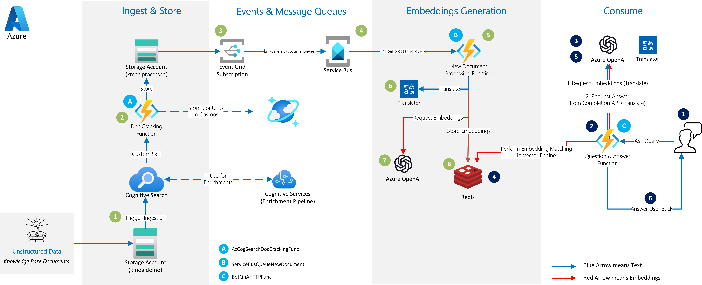

 
 

# Purpose
The purpose of this repo is to accelerate the deployment of a Python-based Knowledge Mining solution with OpenAI that will ingest a Knowledge Base, generate embeddings using the contents extracted, store them in a vector search engine (Redis), and use that engine to answer queries / questions specific to that Knowledge Base.

The Cognitive Search component serves to make it easier to ingest a Knowledge Base with a variety of document formats. The Cognitive Services component connected to the Search makes it possible to have an enrichment pipeline. This pipeline can generate information based on images for example, which can be included at the time of generating embeddings. 

This repo also includes a guide to build a Power Virtual Agent bot that could be used and adapted to connect to this solution, to create an end-to-end Knowledge Base Chatbot.
 
 
 

# Features
The below are the features of this solution:

1. Support for ChatGPT (gpt-35-turbo), and keeping conversations (sessions) with a "session_id" key

1. Improved prompts and workflow handling with LangChain. The user should see improved search results in the form of better answers.
 
1. Using both Redis and Cognitive Search (Vector Search and Semantic Search) as tools for the LangChain Agent. Also, added Bing as a third search tool, which can be enabled or disabled.

1. Added filtering support in the Bot HTTP request API. This would be useful for things like multi-tenant demos, and filtering on docuemnts with an original source language. Use `"filter":"@field:value"` in the HTTP request e.g. `"filter":"@orig_lang:en"`.

1. Automatic segmenting / chunking of documents with overlap based on the specified number(s) of tokens for each OpenAI model to generate embeddings.
 
1. Calculating embeddings from multiple segment / chunk sizes for the same document in order to maximize vector matching. Through experimentation, we determined that having embeddings generated from the following chunk sizes of the same document would optimize accuracy (number of correctly answered queries). These experiments are however conducted on one specific dataset, and might change in the future as we experiment on more datasets. So it is highly encouraged to experiment with the following parameters in the Function App Configuration: `SMALL_EMB_TOKEN_NUM`, `MEDIUM_EMB_TOKEN_NUM`, `LARGE_EMB_TOKEN_NUM` and `X_LARGE_EMB_TOKEN_NUM`.

1. No maximum limit on document size except the limit imposed by Cognitive Search (4 million characters per document for the Standard Tier). If more is needed, then higher Search tiers can be used.

1. Added support for Form Recognizer, where Form Recognizer can complement Cognitive Search when it comes to ingesting Forms

1. Cosmos DB is used to store the contents of the ingested files. Cosmos is also used to store the generated embeddings, and automatically load them when the Redis index is empty.

1. Managing OpenAI API rate limiting and mitigating its impact by processing the documents serially, and retrying OpenAI API calls with exponential backoff when hitting limit errors

1. The ability to configure a wide range of parameters by changing the Function App parameters, including the models used for OpenAI Embedding and Completion API calls, chunk size, etc..

1. Automatic translation from/to English using Cognitive Services, since OpenAI works best with English

1. The Cognitive Search ecosystem provides the potential to add a wide variety of custom skills, as well as access the native search capabilities which can complement the embedding search in Redis.

1. Automatic deployment of the Azure Functions from this repo to the Function App

1. This repo has been tested with Python 3.8 and 3.9

 
 

# Search Parameters
Multiple Search Parameters have been added to control the behavior of the agent. The below values are all `false` **by default**. This can be tested in Postman or the interacting bot:

1. `search_method`: this parameter can take 3 values `'os'`, `'ccr'` and `'zs'`. `'os'` corresponding to the 3 available agents. `'os'` stands for 'One-Pass' agent, `'ccr'` stands for Concersational-Chat-ReAct agent, `'zs'` stands for Zero-Shot-ReAct agent. Both `'ccr'` and `'zs'` use LangChain agents. In terms of performance, `'os'` is fast but with the lowest quality of answers. `'zs'` is the slowest but with the highest quality of anwers, and `'ccr'` is right in the middle in terms of answer quality and latency. For interactive chat bots, `'ccr'` is recommended.

1. `enable_unified_search`: Unified Search searches Redis and Cognitive Search at the same time with parallel calls, and interleaves the results.

1. `enable_redis_search`: enables search with embeddings in Redis

1. `enable_cognitive_search`: enables semantic search and lookup in Cognitive Search. Use `USE_COG_VECSEARCH` in the Func App Configuration (or your .env file) to switch between Semantic Hybrid Search (search with vectors) and simple Semantic Search. This is using the "2023-07-01-Preview" APIs for enabling vector search in Cognitive Search.

1. `evaluate_step`: search text results sometimes have the answer to the question but the results might be so long that OpenAI completion call might miss that information (too much noise). `evaluate_step` was created to address this problem. This is a separate call to the OpenAI Completion API to identify the facts that are relevant only to the question. 

1. `check_adequacy`: checks the adequacy of the answer and if the answer does look ok (sometimes a problem with LangChain agents), this step will retry for an answer, up to 3 retries.

1. `check_intent`: checks the intent of the question. If this is a question that is more 'chit-chatty', like 'hi' or 'how are you?' then answer it immediately without going through the search tools of the knowledge base.

1. `use_calendar`: it is a tool to be added to the LangChain agents to insert the date and time into the prompt. This is handy if the solution is expecting any questions like "what are the offers tomorrow?"
 
1. `use_calculator`: for when math calculations are needed.

1. `use_bing`: enables the use of Bing Search in the results. Bing Search will result snippets from the highest matching websites (or only from the supplied restricted list), and those snippets will be inserted in the Completion API prompt.

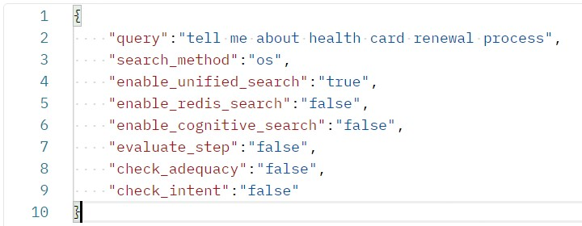

 

In general, `zs` will get you better results but is considerably slower than `os` since the LangChain agent might make several calls to the OpenAI APIs with the different tools that it has, and `'ccr'` is right in the middle in terms of answer quality and latency. 

 
 

## Comparative Example of the 3 Agents with GPT-4

All 3 agents do well when the queries are simple and / or the information can be retrieved from a single document. However, where the Zero-Shot-ReAct Agent really shines is when the query is complicated with multiple parts to it, and the information is spread over multiple documents in the Knowledge Base. 

The below is a simple illustrative example. The knowledge base consists of the sample documents around "Margie's Travel" agency and thus include 6 brochures about fictional hotels. The Wikipedia page about Sherlock Holmes has also been downloaded and ingested. To run this test, we came up with a question of 2 parts that are not directly related: `"did Sherlock Holmes live in the same country as where the Volcano hotel is located?"`. From the question, the first part asks about Sherlock Holmes, the second asks about the Volcano Hotel, and the LLM needs to deduce whether they have both lived or are located in the same country. 

Here are the results:

1. The One-Pass Agent searched Redis (or Cognitive Search) for the full question, and got all the top ranking results about Sherlock Holmes. The final answer is `"I'm sorry, I could not find any information about the Volcano Hotel in the provided context."`

1. The Conversational-Chat-ReAct Agent gave a mixed bag of results. Because it has not been explicitly instructed in the prompt how many iterations it can do, sometimes it did one search in Redis (or Cognitive Search), and sometimes two searches. The first search is almost always about Sherlock Holmes, with the search string `"Sherlock Holmes country"`. If it did go for a second search iteration, then it looks for `"Volcano hotel country"`. The final answer is either `"Sherlock Holmes is a fictional character from the United Kingdom. However, I do not have information about the location of the Volcano hotel."` or, when it does 2 searches, then it gets `"The Volcano Hotel is located in Las Vegas, United States. Sherlock Holmes lived in London, England . Therefore, Sherlock Holmes did not live in the same country as the Volcano Hotel."`.

1. The Zero-Shot-ReAct Agent really shines here because it is explicitly told that it can do multiple searches in the context of answering a single query. It first searches Redis (or Cognitive Search) for `"Sherlock Holmes country"`, and then searches again for `"Volcano hotel location"`, and gives the right answer every time: `"Sherlock Holmes lived in London, England, while the Volcano Hotel is located in Las Vegas, United States. They are not in the same country."`.

 
 

## Architecture

The below is the  Architecture of the bot-serving function, including all options:
 
 

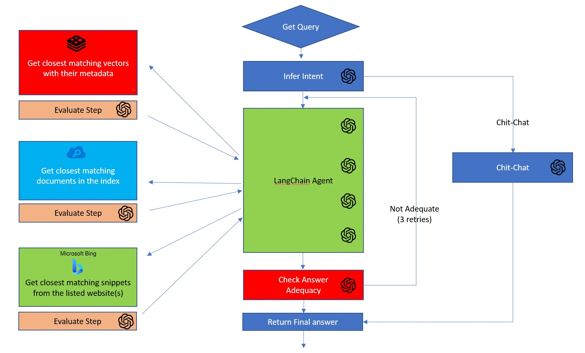

 

 
 

# Conversation Sessions with GPT-4, ChatGPT, and DaVinci 

To hold a conversation, then the first communication is sent to the Azure Function as usual in the form of JSON, with the query key:

 
 

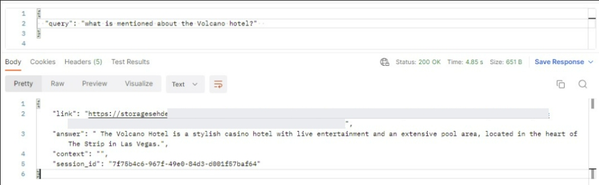

 
 
If the user wants to continue the conversation with a new question but not start from scratch with a new query, then the response to the initial request returns a "session_id" key in JSON, that the end user bot or application could just very simply copy, and re-send along the "query" in the follow-up API call. The below is the body of the POST request:
 
 

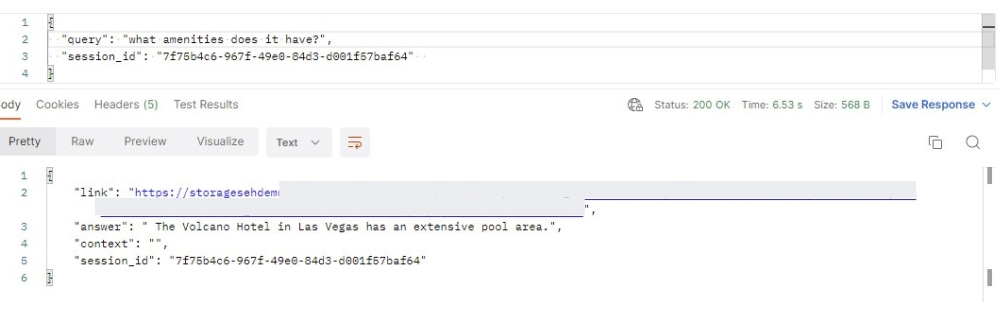

 
 

If the user doesn't to keep the conversation going, then the application should drop the "session_id" field in the next request.

 
 

# Streaming Answers and Latency

The repo now comes with its own Flask web server that could be run locally on any laptop on port 5000. The Flask server implements SocketIO and showcases the streaming capabilities of OpenAI. This hugely helps with the **latency problem**. Instead of waiting for 10-15 seconds for the final generated answers, the user can start reading the first few words of the answer after a few seconds, without waiting for the fully generated answer.

To run this web server, use the following command in the root folder of the project: 

`flask --app app.py --debug run`

To be able to run this, activate the venv first using the following command on Windows:

`.\.venv\Scripts\activate`

Then install the required packages using the following command:

`pip install -r requirements.txt`

 

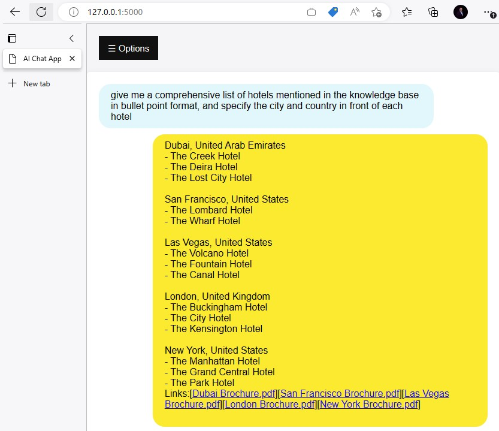

 
 

 
 

# Upcoming Features

1. GUI for triggering Cognitive Search and Form Recognizer document ingestion
1. ARM: Adding Application Insights to the ARM template
1. Code: Adding a custom skill that processes csv files
1. Code: Adding a demo for HTML crawling
1. Code: Adding an embedding match filtering (in Redis) for filtering on metadata 
1. Integrating the features of the new repo from CogSearch PG into this one

 
 

# Deployment Guide
 

The ARM template is not fully automated (yet), so a few manual steps will have to be taken to set up your project:

1. At the deployment stage of the ARM template, please choose a suffix that will be added to all your resource names. This will make sure to avoid name conflicts for the resources.
     
     
    

     
    

     

1. When it comes to the OpenAI resource, there are 3 choices:
    * The first option is to choose "no" in the "Deploy New OpenAI Resource", and then provide an existing OpenAI resource. In this case, please provide the endpoint and key values in the "Existing Open AI Resource" fields

    * The second option is to choose "yes" which will then create a new OpenAI resource in this Resource Group. This is also based on the choice in the "New OpenAI Resource Location Field", which is one of the following 3 regions where OpenAI can be deployed: West Europe, East US, South Central US
     
     
    

    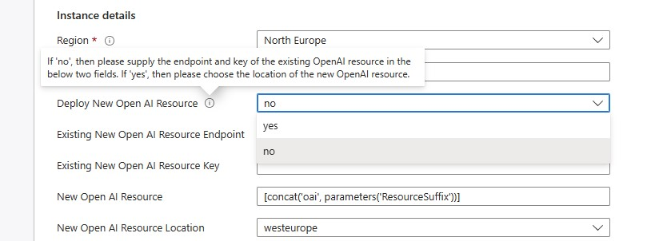 
    

     

    * The third option is to choose "no", but also you do not provide an existing OpenAI resource. This might happen if you want to deploy the solution now and you will supply the OpenAI resource credentials later. In that case, these values can be updated later in the "Configuration" section of the Function App. 

     
     
    

    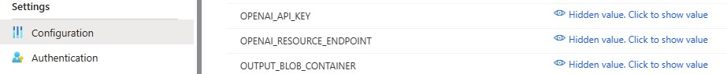 
    

     

1. When it comes to Redis Enterprise, then same as the previous step, the user has the choice to deploy it or not.
     
     
    

    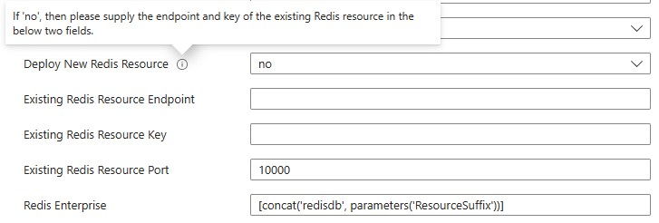 
    

     
1. Once deployment is done, go to the "Outputs" section at the left-hand side:
     
     
    

    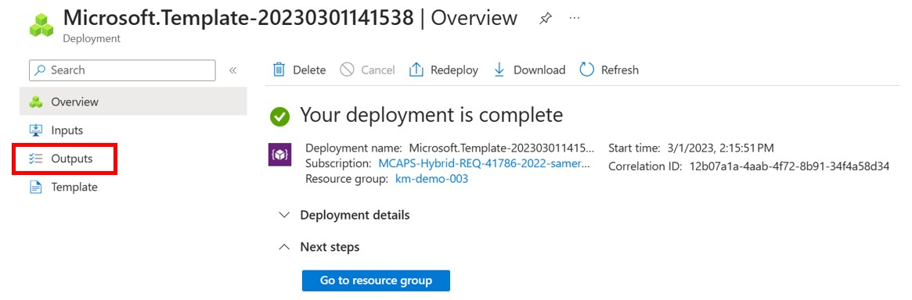 
    

     
1. From the Outputs section, please copy these values (or keep this browser page open) as you will need them in the .env file, to kickstart the Cognitive Search ingestion process. More on this in the next step.
     
     
    

    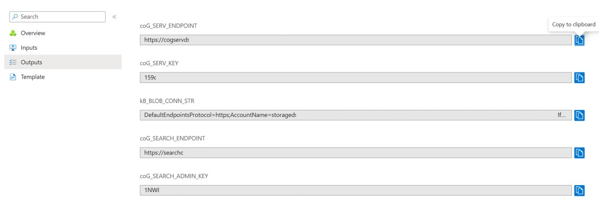 
    

     

1. Update the .env in VS Code with the 5 settings you got out of the previous step from the Outputs section. And one additional setting (COG_SEARCH_CUSTOM_FUNC) you can get from the Azure Portal or from VS Code as detailed below: 
   * Cognitive Search settings: COG_SEARCH_ENDPOINT endpoint and COG_SEARCH_ADMIN_KEY primary key (2 settings)
   * Cognitive Services settings: COG_SERV_ENDPOINT endpoint and COG_SERV_KEY primary key (2 settings)
   * Blob Connection String KB_BLOB_CONN_STR (1 setting)
   * Custom Skill URI COG_SEARCH_CUSTOM_FUNC which you can get out of the "AzCogSearchDocCrackingFunc" from VS Code (1 setting)
     
     
    

    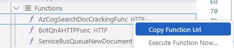
    

     
1. **(Optional)** For troubleshooting and log monitoring, please go to the Function App, and then click on one of the deployed functions, and then the “Monitor” tab. Then please create the Application Insights resource. Application Insights will allow you to monitor and check function logs.
     
     
1. Deploy 3 models in OpenAI:
   * Go to Deployments in your OpenAI resource. Please **keep the model name and deployment name the same**:
   * Add the below 3 models (and the 2 GPT-4 models if available):
      1. gpt-35-turbo
      1. text-embedding-ada-002
      1. text-davinci-003 
      1. gpt-4
      1. gpt-4-32k
      
     
     
    

    
    

     

1. Enable Semantic Search in your Cognitive Search resource by clicking on "Select Plan" in the "Semantic Search" setting. For testing, you could enable the Free monthly plan. For other scenario, you can enable the paid monthly plans.
     
     
    

    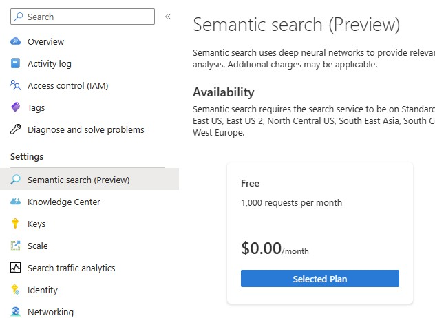
    

     
     

1. Upload the KB documents to the Blob Storage container “kmoaidemo”
     
     

1. Before running the "experiments.ipynb" notebook, a Conda environment will need to be created. Python 3.8 and 3.9 were tested and worked fine. The packages can either be installed from within the first cell of the notebook, or run pip install after activating the new environment:

    `pip install -r requirements.txt`
    
     

1. Start the search by running the third cells in “experiment.ipynb” notebook
     
     
    

    
    

     
     
1. **(Optional)** "redis.yml" is also included with this repo. This is optional but might be needed if the user wants to use a Redis ACI instead of Redis Enterprise for development purposes. You can create the Redis container on ACI using the following command: 
        `az container create --resource-group <YOUR_RG_NAME> --file redis.yml`
     
     
1. **(Optional)** Cosmos DB is added for development purposes as well. In the Function App settings, there is a field "DATABASE_MODE" that controls the behavior of the Custom Skill in Cognitive Search. If set to 0 (which is the default), it will save the documents contents in the Blob Storage. If it's set to 1, it will create records in Cosmos DB. Cosmos can then be accessed programmatically from a Python notebook to test around with embeddings and completions.

 
 

# Knowledge Base - Web Pages
Cognitive Search should be able to ingest a wide variety of document formats, such as Word documents, PDFs, Excel and CSV files, JSON files, etc.. When it comes to Knowledge Base, a common ask might be to include web pages as well. If the data cannot be easily downloaded, then there are two options:
1. Cognitive Search have a few [connectors](https://learn.microsoft.com/en-us/azure/search/search-data-sources-gallery) for web crawling, such as: [Selenium](https://contentanalytics.digital.accenture.com/display/aspire40/Selenium+Crawler) and [Aspider](https://contentanalytics.digital.accenture.com/display/aspire40/Aspider+Web+Crawler)
1. The OpenAI Cookbook has an [example notebook](https://github.com/openai/openai-cookbook/tree/main/apps/web-crawl-q-and-a) about crawling web pages with BeaufitulSoup

 
 

# Troubleshooting
The below are troubleshooting steps in case you face any problems with the solution:
1. Please monitor the Azure Functions logs for any errors or exceptions.
1. If for whatever reason, there was an mistake while writing the .env settings, please remember to restart the kernel in the notebook after correcting them, in order for the changes to take effect.
1. If for whatever reason, there was an mistake while writing the settings in the Function App Configuration, then please restart the Function App from the Azure portal, in order for the changes to take effect.
1. Please install [Redis Insight](https://redis.com/redis-enterprise/redis-insight/) if you want to inspect the embeddings in Redis.
     
     
    

    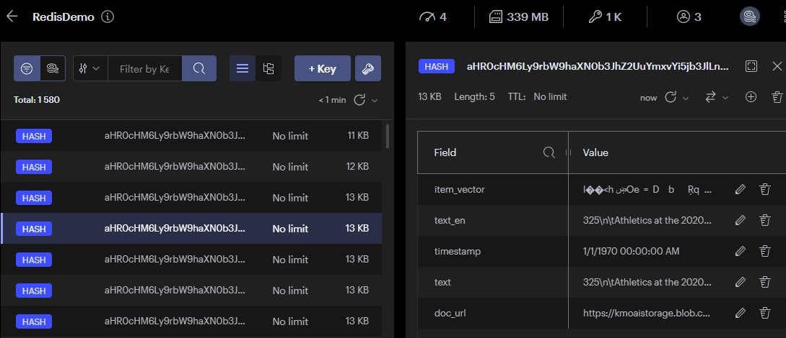
    

     

 
 

# Interfacing with the Solution: Chatbot and Postman
For both cases below, please note that the "BotQnAHTTPFunc" Azure Function returns plain text. This could be easily changed to return the response in JSON format:

1. In this repo, there's a general guide "[AzureOpenAIandPVAbot.pdf](AzureOpenAIandPVAbot.pdf)" to build chat bots using Power Virtual Agents. This guide can be adapted and used to build a bot that will interface with the already deployed "BotQnAHTTPFunc" Azure Function in the Function App. The returned link for the document below has been hidden:
     
     
    

    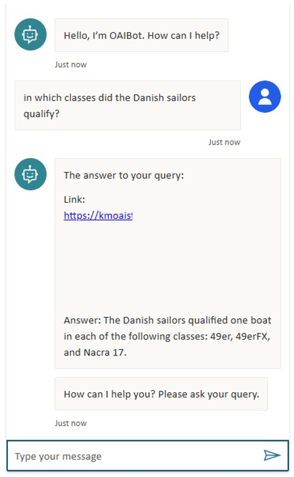
    

     
1. Postman could also be used to connect to the deployed "BotQnAHTTPFunc" Azure Function in the Function App. The full URL for the function can be copied from the Function App in the Azure portal.
     
     
    

    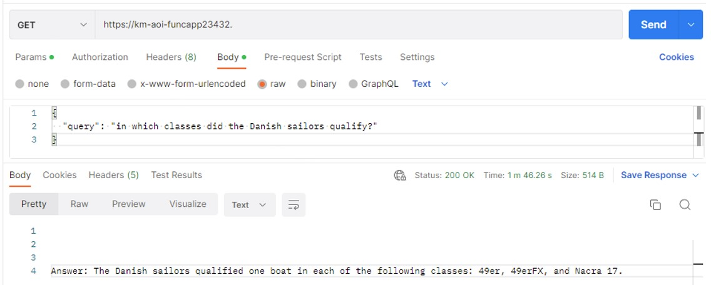
    

     
1. The following queries can be used to try thew new service with the current sample dataset:
    * `In which classes did the Danish sailors qualify?`
    * `What are the reviews of the Lost City hotel?`
    * `what are the reviews of the Atlantis hotel?` -> this should give a negative answer as it is not included in the sample knowledge base.

 
 

 
 

# AI Rangers Solution Accelerators

Developed by the Microsoft AI Rangers Team, the AI Solution Accelerators are repeatable IP meant to provide developers with all the resources needed to quickly build an initial solution. The objective is to jump-start the development efforts and to learn the used technologies in as little time as possible. The AI Solution Accelerators should be considered as templates that are fully customizable to the user's unique business case. You can see the **list of accelerators** in the following link: [aka.ms/aiaccelerators](https://aka.ms/aiaccelerators). These accelerators can be deployed on the Azure platform. 

Please visit the official [Azure AI webpage](https://azure.microsoft.com/en-us/overview/ai-platform/) to learn more about the Azure AI solution offerings.

 
 

# Contributing

This project welcomes contributions and suggestions.  Most contributions require you to agree to a
Contributor License Agreement (CLA) declaring that you have the right to, and actually do, grant us
the rights to use your contribution. For details, visit https://cla.opensource.microsoft.com.

When you submit a pull request, a CLA bot will automatically determine whether you need to provide
a CLA and decorate the PR appropriately (e.g., status check, comment). Simply follow the instructions
provided by the bot. You will only need to do this once across all repos using our CLA.

This project has adopted the [Microsoft Open Source Code of Conduct](https://opensource.microsoft.com/codeofconduct/).
For more information see the [Code of Conduct FAQ](https://opensource.microsoft.com/codeofconduct/faq/) or
contact [opencode@microsoft.com](mailto:opencode@microsoft.com) with any additional questions or comments.

 
 

# Trademarks

This project may contain trademarks or logos for projects, products, or services. Authorized use of Microsoft 
trademarks or logos is subject to and must follow 
[Microsoft's Trademark & Brand Guidelines](https://www.microsoft.com/en-us/legal/intellectualproperty/trademarks/usage/general).
Use of Microsoft trademarks or logos in modified versions of this project must not cause confusion or imply Microsoft sponsorship.
Any use of third-party trademarks or logos are subject to those third-party's policies.

 
 

@Microsoft Corporation. All right reserved
