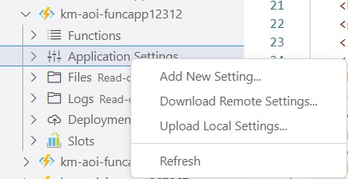
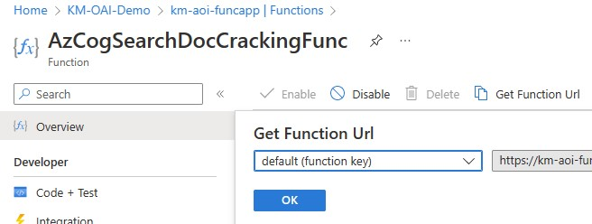

> **Note:**
> Please read the deployment guide below before deploying to Azure

 

 
 
 

# Deployment Guide
 

The ARM template is not fully automated (yet), so a few manual steps will have to be taken to set up your project:

1. At the deployment stage of the ARM template:
   * please deploy all resources in only one of the following 3 regions: West Europe, East US, South Central US
   * rename the instances randomly, a good idea would be to add your suffix to all resources, e.g. "-seh" and "seh" for the storage account
   * please make sure that the Storage account name does not have any hyphens or punctuations
     
     
    

    
    

     
1. Once deployment is done, please update the localSettings.json in VS Code with all the keys and endpoints from all the resources that were just created.Then go to the 
1. Deploy the settings you've just filled in the localSettigns.json to the Function App. Please make sure that the "Azure Functions" extension is installed in your VS Code. Go to the right Function App under the "Resources" section and then right-click on "Application Settings" and "Upload Local Settings..."
     
     
    

    
    

     
1. Deploy the Azure Functions to the FuncApp. During functions deployment in VS Code. The deployment will ask for a storage account, please supply the one in the RG
1. Update the .env in VS Code for: 
   * Cognitive Search settings: endpoint and primary key
   * Cognitive Services settings: endpoint and primary key
   * Blob Connection String
   * Get the Azure Function URI of the "AzCogSearchDocCrackingFunc" from the Azure Portal, and write it in the "COG_SEARCH_CUSTOM_FUNC" field in .env
     
     
    

    
    

     
1. Go to the FuncApp, and then click on one of the deployed functions, and then the “Monitor” tab. Then please create the application insights. This step is only needed for troubleshooting
1. Deploy 4 models in OpenAI:
   * Go to Deployments in your OpenAI resource
   * Add 4 models:
      1. text-davinci-003
      1. text-search-davinci-doc-001
      1. text-search-davinci-query-001
      1. text-embedding-ada-002
     
     
    

    
    

     
1. Upload the KB documents to the Blob Storage container “kmoaidemo”
1. Start the search by running the first two cells in “experiment.ipynb” notebook
     
     
    

    
    

     
1. **(Optional)** "redis.yml" is also included with this repo. This is optional but might be needed if the user wants to use a Redis ACI instead of Redis Enterprise for development purposes. You can create the Redis container on ACI using the following command: 
        `az container create --resource-group <YOUR_RG_NAME> --file redis.yml`
1. **(Optional)** Cosmos DB is added for development purposes as well. In the Function App settings, there is a field "DATABASE_MODE" that controls the behavior of the Custom Skill in Cognitive Search. If set to 0 (which is the default), it will save the documents contents in the Blob Storage. If it's set to 1, it will create records in Cosmos DB. Cosmos can then be accessed programmatically from a Python notebook to test around with embeddings and completions.

