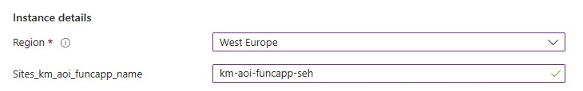
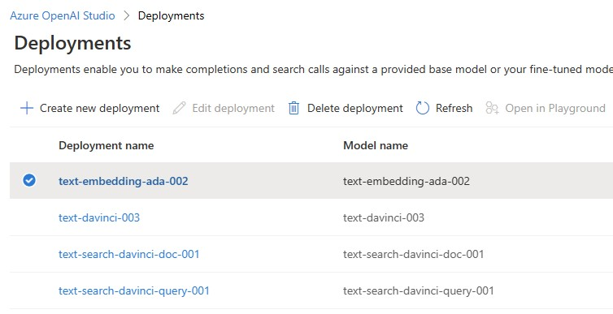
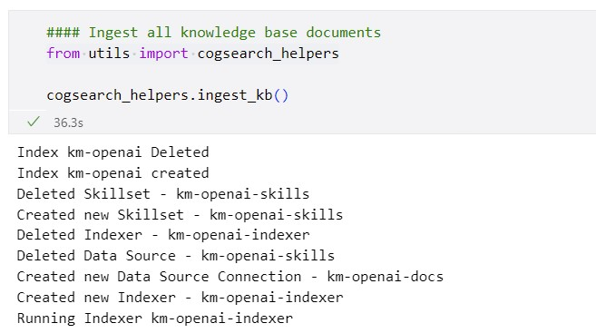

 

  
  
 

The ARM template is not fully automated (yet), so a few manual steps will have to be taken to set up your project:

1. At the deployment stage of the ARM template:
   * please deploy all resources in only one of the following 3 regions: West Europe, East US, South Central US
   * rename the instances randomly, a good idea would be to add your suffix to all resources, e.g. "-seh" and "seh" for the storage account
   * please make sure that the Storage account name does not have any hyphens or punctuations
 

 
1. Once deployment is done, update the localSettings.json in Code with all the keys
1. Deploy the Azure Functions to the FuncApp. During functions deployment in VS Code:
   * First, please upload the local settings to the FuncApp
   * it will ask for a storage account, please supply the one in the RG
1. Update the .env in Code for: 
   * CogSearch settings
   * CogServ settings
   * Azure Function URI
   * Blob Connection String
1. Go to the FuncApp, and then click on one of the deployed functions, and then the “Monitor” tab. Then please create the application insights. This step is only needed for troubleshooting
1. Deploy 4 models in OpenAI:
   * Go to Deployments in your OpenAI resource
   * Add 4 models:
      1. text-davinci-003
      1. text-search-davinci-doc-001
      1. text-search-davinci-query-001
      1. text-embedding-ada-002
 

 
1. Upload the KB documents to the Blob Storage container “kmoaidemo”
1. Start the search by running the first two cells in “experiment.ipynb” notebook
 

 
1. "redis.yml" is also included with this repo. This is optional but might be needed if the user wants to use a Redis ACI instead of Redis Enterprise for development purposes.

