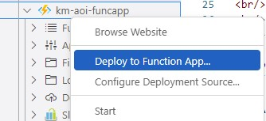

> **Note:**
> Please read the deployment guide below before deploying to Azure

 

 
 

# Architecture
 
 

 
 

# Purpose
The purpose of this repo is to accelerate the deployment of a Knowledge Mining solution that will ingest a Knowledge Base, generate embeddings using the contents extracted, store them in a vector search engine (Redis), and use that engine to answer queries / questions specific to that Knowledge Base.

The Cognitive Search component serves to make it easier to ingest a Knowledge Base with a variety of document formats. The Cognitive Services component connected to the Search makes it possible to have an enrichment pipeline. This pipeline can generate information based on images for example, which can be included at the time of generating embeddings. 

This repo also includes a guide to build a Power Virutal Agent bot that could be used and adapted to connect to this solution, to create an end-to-end Knowledge Base Chatbot.
 
 
 

# Deployment Guide
 

The ARM template is not fully automated (yet), so a few manual steps will have to be taken to set up your project:

1. At the deployment stage of the ARM templat, please deploy all resources in only one of the following 3 regions: West Europe, East US, South Central US
     
     
    

     
    

     
1. Once deployment is done, go to the "Outputs" section at the left-hand side:
     
     
    

     
    

     
1. From the Outputs section, please copy these values as you will need them in the .env file, to kickstart the Cognitive Search ingestion process.
     
     
    

     copyoutputs
    

     
1. The next step would be to deploy the Azure Functions to the FuncApp. During functions deployment in VS Code. The deployment will ask for a storage account, please supply the one in the RG
     
     
    

    
    

     
1. Update the .env in VS Code with the 5 settings you got out of Step #3 from the Outputs section. And one additional setting you can get from VS Code as detailed below: 
   * Cognitive Search settings: COG_SEARCH_ENDPOINT endpoint and COG_SEARCH_ADMIN_KEY primary key (2 settings)
   * Cognitive Services settings: COG_SERV_ENDPOINT endpoint and COG_SERV_KEY primary key (2 settings)
   * Blob Connection String KB_BLOB_CONN_STR (1 setting)
   * Custom Skill URI COG_SEARCH_CUSTOM_FUNC which you can get out of the "AzCogSearchDocCrackingFunc" from VS Code (1 setting)
     
     
    

    
    

     
1. Go to the FuncApp, and then click on one of the deployed functions, and then the “Monitor” tab. Then please create the application insights. This step is only needed for troubleshooting
     
     
1. Deploy 4 models in OpenAI:
   * Go to Deployments in your OpenAI resource
   * Add 4 models:
      1. text-davinci-003
      1. text-search-davinci-doc-001
      1. text-search-davinci-query-001
      1. text-embedding-ada-002
     
     
    

    
    

     
1. Upload the KB documents to the Blob Storage container “kmoaidemo”
     
     
1. Before running the "experiments.ipynb" notebook, a Conda environment will need to be created. Python 3.8 and 3.9 were tested and worked fine. The packages can either be installed from within the first cell of the notebook, or run pip install after activating the new environment:

    `pip install -r requirements.py`
    
 
1. Start the search by running the third cells in “experiment.ipynb” notebook
     
     
    

    
    

     
1. **(Optional)** "redis.yml" is also included with this repo. This is optional but might be needed if the user wants to use a Redis ACI instead of Redis Enterprise for development purposes. You can create the Redis container on ACI using the following command: 
        `az container create --resource-group <YOUR_RG_NAME> --file redis.yml`
1. **(Optional)** Cosmos DB is added for development purposes as well. In the Function App settings, there is a field "DATABASE_MODE" that controls the behavior of the Custom Skill in Cognitive Search. If set to 0 (which is the default), it will save the documents contents in the Blob Storage. If it's set to 1, it will create records in Cosmos DB. Cosmos can then be accessed programmatically from a Python notebook to test around with embeddings and completions.

 
 

# Knowledge Base - Web Pages
Cognitive Search should be able to ingest a wide variety of document formats, such as Word documents, PDFs, Excel and CSV files, JSON files, etc.. When it comes to Knowledge Base, a common ask might be to include web pages as well. If the data cannot be easily downloaded, then there are two options:
1. Cognitive Search have a few [connectors](https://learn.microsoft.com/en-us/azure/search/search-data-sources-gallery) for web crawling, such as: [Selenium](https://contentanalytics.digital.accenture.com/display/aspire40/Selenium+Crawler) and [Aspider](https://contentanalytics.digital.accenture.com/display/aspire40/Aspider+Web+Crawler)
1. The OpenAI Cookbook has an [example notebook](https://github.com/openai/openai-cookbook/tree/main/apps/web-crawl-q-and-a) about crawling web pages with BeaufitulSoup

 
 

# Troubleshooting
The below are troubleshooting steps in case you face any problems with the solution:
1. Please monitor the Azure Functions logs for any errors or exceptions.
1. If for whatever reason, there was an mistake while writing the .env settings, please remember to restart the kernel in the notebook after correcting them, in order for the changes to take effect.
1. If for whatever reason, there was an mistake while writing the settings in the Function App Configuration, then please restart the Function App from the Azure portal, in order for the changes to take effect.
1. Please install [Redis Insight](https://redis.com/redis-enterprise/redis-insight/) if you want to inspect the embeddings in Redis.
     
     
    

    
    

     

 
 

# Interfacing with the Solution: Chatbot and Postman
For both cases below, please note that the "BotQnAHTTPFunc" Azure Function returns plain text. This could be easily changed to return the response in JSON format:

1. In this repo, there's a general guide "AzureOpenAIandPVAbot.pdf" to build chat bots using Power Virtual Agents. This guide can be adapted and used to build a bot that will interface with the already deployed "BotQnAHTTPFunc" Azure Function in the Function App. The returned link for the document below has been hidden:
     
     
    

    
    

     
1. Postman could also be used to connect to the deployed "BotQnAHTTPFunc" Azure Function in the Function App. The full URL for the function can be copied from the Function App in the Azure portal.
     
     
    

    
    

     
1. The following queries can be used to try with the current sample dataset to try the new service:
    * `In which classes did the Danish sailors qualify?`
    * `What are the reviews of the Lost City hotel?`
    * `what are the reviews of the Atlantis hotel?` -> this should give a negative answer as it is not included in the sample knowledge base.

 
 

# AI Rangers Solution Accelerators

Developed by the Microsoft AI Rangers Team, the AI Solution Accelerators are repeatable IP meant to provide developers with all the resources needed to quickly build an initial solution. The objective is to jump-start the development efforts and to learn the used technologies in as little time as possible. The AI Solution Accelerators should be considered as templates that are fully customizable to the user's unique business case. You can see the **list of accelerators** in the following link: [aka.ms/aiaccelerators](https://aka.ms/aiaccelerators). These accelerators can be deployed on the Azure platform. 

Please visit the official [Azure AI webpage](https://azure.microsoft.com/en-us/overview/ai-platform/) to learn more about the Azure AI solution offerings.

 
 

